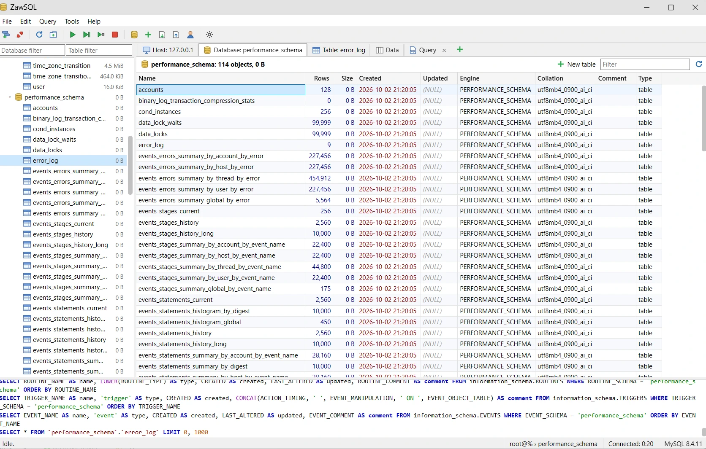
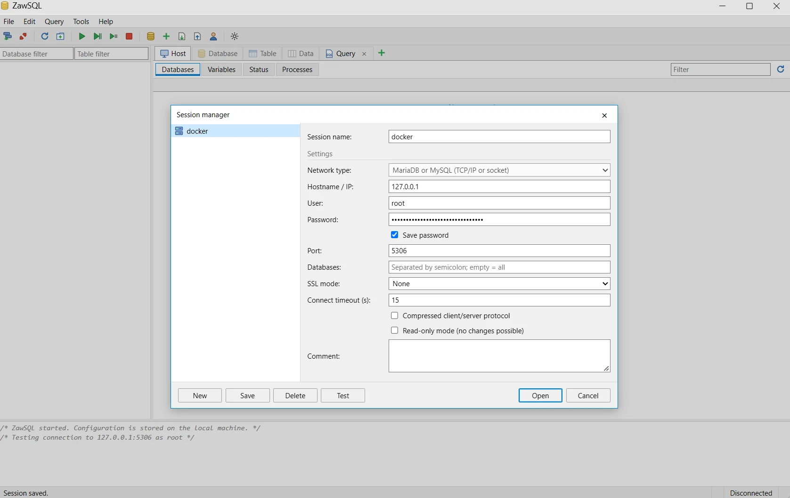
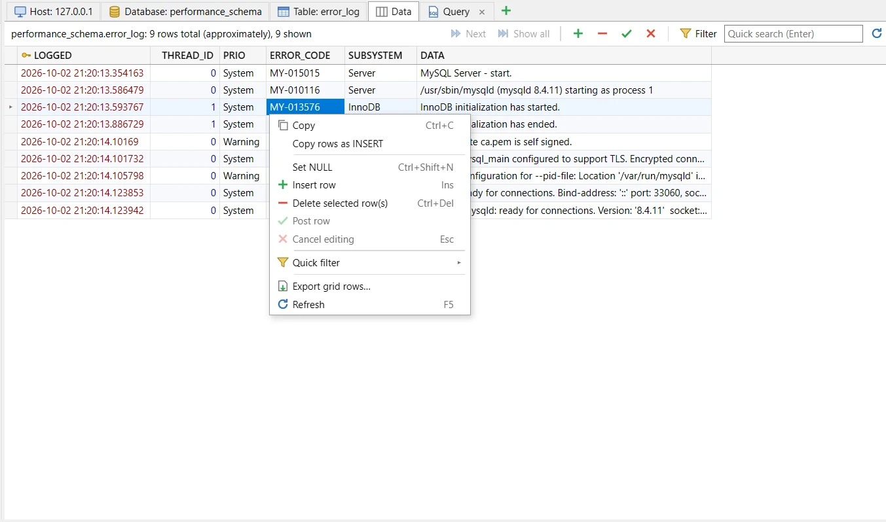
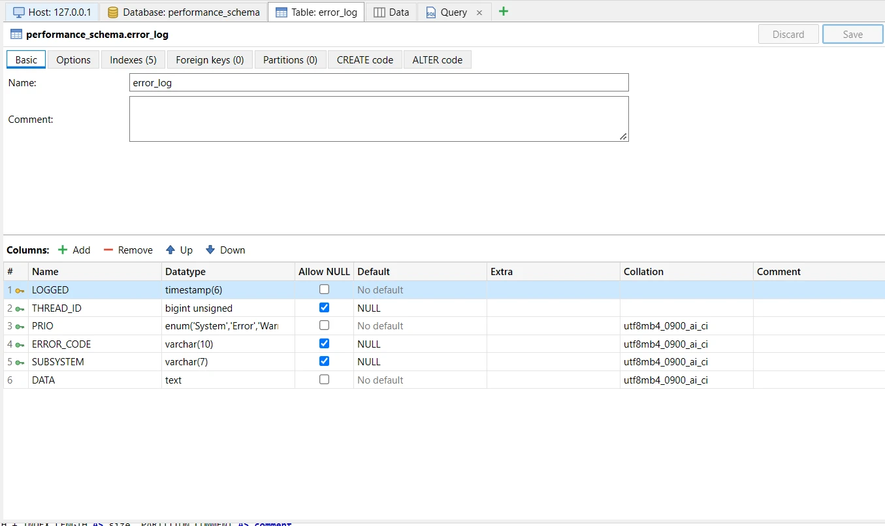
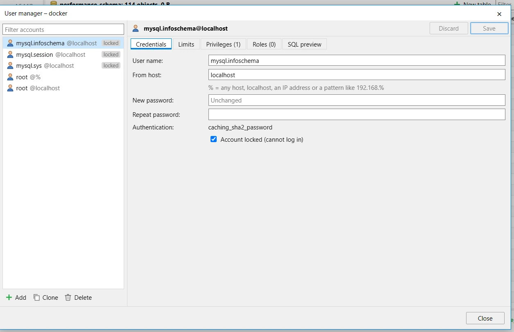
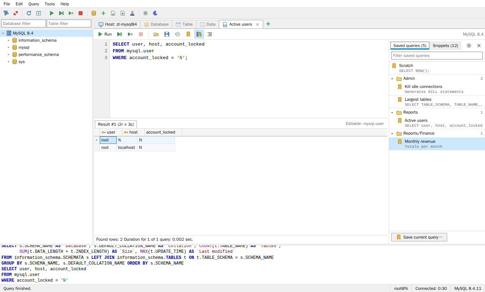
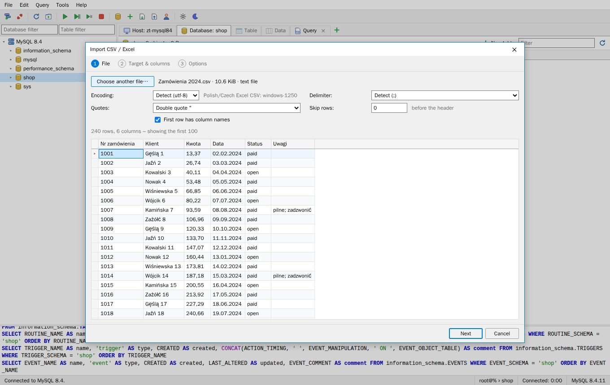
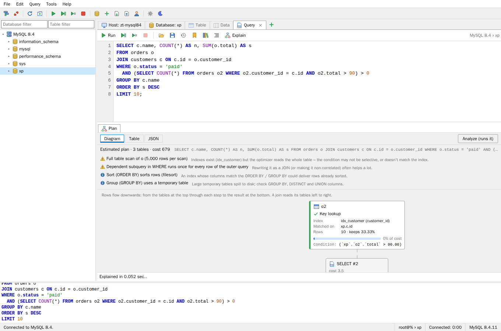
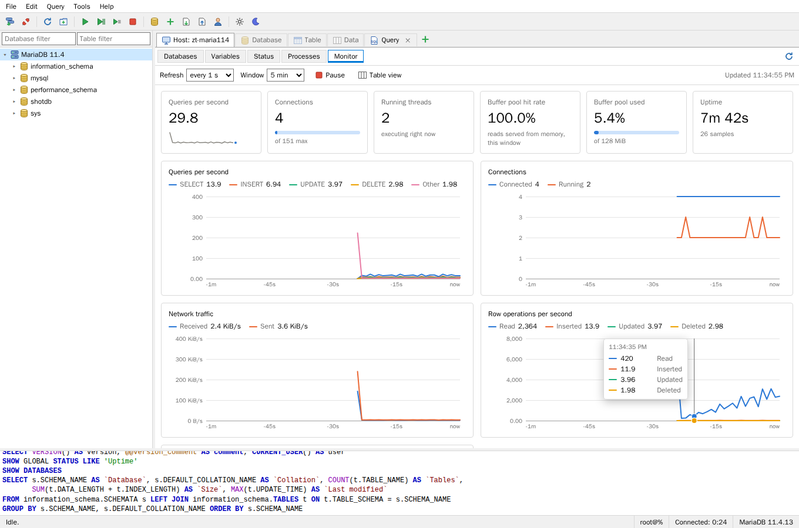
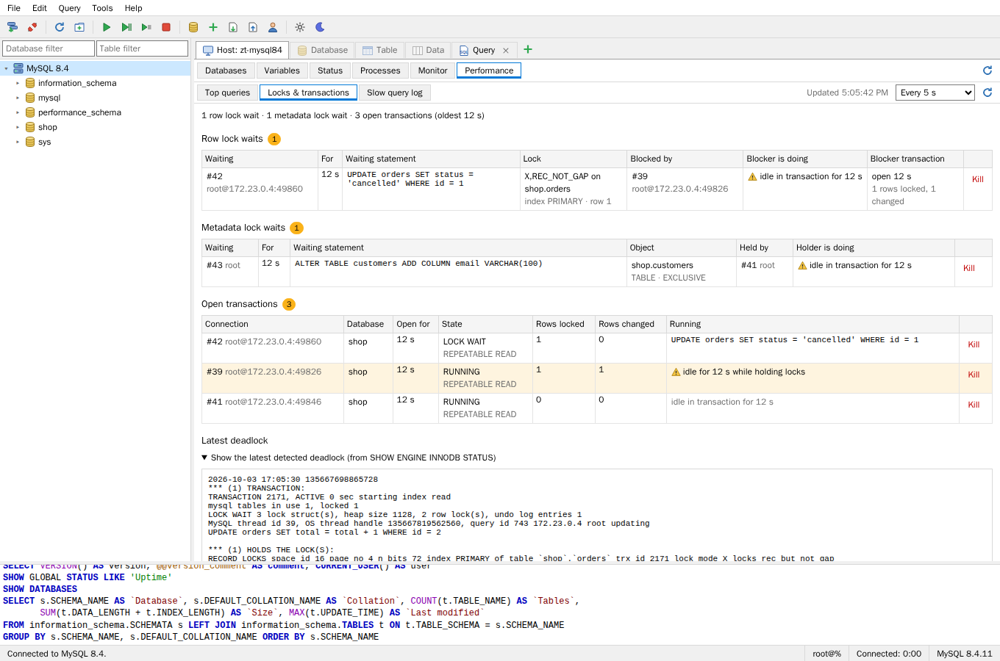

# ZawSQL

A lightweight MySQL / MariaDB desktop client in the spirit of HeidiSQL, written in C#.

The backend is an ASP.NET Core app that talks to the database (via [MySqlConnector](https://mysqlconnector.net/)). The UI is plain HTML/CSS/JS embedded in the executable. ZawSQL opens it in a chromeless **app-mode window** of an installed Chromium browser (Chrome, Edge, Chromium or Brave), so it looks and behaves like a desktop window on **Windows, Linux and macOS**. Closing the window quits the app.



## Features

- **Session manager**: saved connections (TCP/IP or Unix socket), SSL modes, compression, database filter, connection test. Saved passwords are encrypted (AES-GCM) with a per-user key.
- **SSH tunnels** (session manager › SSH tunnel): connect through an SSH server, authenticating with a password or a private key (file path or pasted key, optionally with a passphrase). The MySQL host and port are then entered as seen from the SSH server.
  - On first contact ZawSQL shows the server's host key fingerprint and asks you to trust it. If the key ever changes, the connection is refused with a man-in-the-middle warning.
  - SSH passwords and passphrases are encrypted like database passwords and never logged.
  - A dropped tunnel is re-established automatically on the same local port.
- **Session colors and production mark** (session manager):
  - **Color:** pick a color per session. The tree shows a colored stripe and tint, a line runs above the tabs, and the status bar shows it.
  - **"Production server":** adds a PROD badge, a PRODUCTION status-bar marker and `[PRODUCTION]` in the window title. Every change asks for confirmation first: data- or schema-changing statements in query tabs (read-only queries run without asking), grid edits, structure and routine saves, Run SQL file, create database and user-manager changes. The dialog lists the statements and offers "don't ask again until I reconnect".
  - **Every session:** `UPDATE`/`DELETE` without a `WHERE` clause asks before running. This can be switched off in Preferences.
- **Read-only mode** (a checkbox per session in the session manager): nothing can be changed through that connection. The tree and status bar show a red READ-ONLY badge, and editing, structure saving, drop/truncate/rename, Run SQL file and kill are disabled. The backend enforces it in two layers:
  1. Only `SELECT`, `WITH`, `SHOW`, `DESCRIBE`, `EXPLAIN`, `USE`, `TABLE`, `VALUES` and `HELP` statements may run. `SET`, `CALL`, DDL, `INTO OUTFILE` and executable `/*! */` comments are refused, as are data changes hidden in `WITH … DELETE` or several statements packed into one.
  2. The connection runs with `SET SESSION TRANSACTION READ ONLY`, so MySQL itself also rejects writes that the first layer can't see, such as a stored function called from a `SELECT` that modifies data.
- **Object tree**: sessions › databases › tables, views, procedures, functions, triggers, events, with sizes. Database/table filter boxes, keyboard navigation, context menus.
- **Host tab**: databases with sizes, session/global variables, status, process list (auto-refresh, kill).
- **Server monitor** (Host tab › Monitor): live charts of queries per second by type, connections, network traffic, row operations and problem indicators (slow queries, temp tables on disk, aborted connects), refreshed every 1–10 s over a 1, 5 or 15 minute window. Headline tiles show QPS, connection use against `max_connections`, running threads, buffer pool hit rate and fill, and uptime. Hover or use the arrow keys for exact values. A table view lists current, average and peak of every series, and the active-queries list flags queries slower than `long_query_time` and can kill them (disabled in read-only sessions). The monitor's own polling is subtracted from the numbers and not written to the SQL log. On MariaDB, which has no `Innodb_rows_*` counters, row operations come from the `Handler_*` counters.
- **Slow query and lock insight** (Host tab › Performance), refreshed automatically or on demand:
  - **Top queries:** every statement shape the server ran, from `performance_schema` statement digests. Shows executions, total time with its share, average and slowest run, rows examined and returned per call, and last seen. Sort by any of them and filter by text or database. System statements (including ZawSQL's own metadata queries) are hidden unless you ask. Notes flag queries that use no index, join without an index, create temp tables on disk, examine far more rows than they return, or fail. **Start measuring** shows only what runs from that moment on, to find what's slow right now rather than since the server started. The detail pane shows the formatted query (a real example on MySQL 8) with all counters, and can open it, or its EXPLAIN, in a query tab. **Reset statistics** clears the digests. When `performance_schema` is off (MariaDB's default), the panel says how to turn it on.
  - **Locks & transactions:** row lock waits showing who waits, for how long, which lock on which table, index and row, and who blocks it (its statement, or "idle in transaction for 2 min"). Also metadata lock waits, such as an `ALTER TABLE` stuck behind an open transaction, with the holder on MySQL. Open transactions are listed with age, rows locked and changed, and idle ones holding locks are highlighted. The latest deadlock comes from `SHOW ENGINE INNODB STATUS`. Every blocker and transaction has a **Kill** button (confirmed; unavailable in read-only sessions). Works on MySQL 8 (`data_lock_waits`) and on MariaDB and MySQL 5.7 (`INNODB_LOCK_WAITS`).
  - **Slow query log:** the newest entries of `mysql.slow_log` when the server logs to a table. Otherwise the current settings and the statement that enables it.
  - Nothing here is written to the SQL log, so polling doesn't flood it.
- **Database tab**: all objects with rows, size, dates, engine, collation and comment.
- **Table tab**: structure editor for columns, indexes, foreign keys and options. It shows live **CREATE / ALTER code** and saves with a single ALTER. Views, routines, triggers and events open in a code editor.
- **Partition editor** (Table tab › Partitions): RANGE, RANGE COLUMNS, LIST, LIST COLUMNS, (LINEAR) HASH and (LINEAR) KEY, with a partition list (values, comments, row counts and sizes) or a partition count.
  - Appending RANGE/LIST partitions uses `ADD PARTITION`. Every other change redefines the partitioning, so MySQL refuses changes that would leave rows without a partition instead of silently deleting them.
  - Tables with subpartitions are shown but read-only in the editor.
- **User manager** (Tools menu, toolbar, or right-click a session): list, add, clone, rename and delete accounts. Set passwords, account lock and resource limits. Edit privileges on the global, database, table, column and routine level (including MySQL 8 dynamic privileges and `WITH GRANT OPTION`) and granted roles.
  - Changes become minimal `GRANT`/`REVOKE`/`ALTER USER` statements, shown in an SQL preview before saving.
  - Passwords never reach the SQL log or query history.
  - Read-only sessions can view accounts but not change them.
- **Table maintenance** (Tools menu, or right-click a database, a table or a selection in the Database tab): run Check, Analyze, Checksum, Optimize or Repair, with their options (QUICK, EXTENDED, LOCAL, …), on any set of tables.
  - Tables run one at a time, with progress and a Stop button. The server's messages appear in a grid you can copy or export.
  - Read-only sessions allow only Check and Checksum; production sessions ask before the others.
- **Data tab**: virtualized grid with paging, sorting, WHERE filter, quick search and quick filters. You can edit in place (enum dropdowns, multi-line editor), insert, delete and set NULL. It works on tables without a primary key too.
- **Query tabs**: SQL editor with syntax highlighting, line numbers and autocompletion (tables, columns incl. aliases, keywords, functions). Run all, the selection or the current statement. Supports `DELIMITER` and multiple result sets, has a Stop button and query history. Tabs are restored on the next start.
- **Editable query results**: when a result's table columns all come from one table and include its primary/unique key, you can edit, insert and delete rows right in the result grid (aliased columns work too; computed columns stay read-only). The header shows "Editable: db.table", or "Read-only" with the reason as a tooltip.
- **Visual EXPLAIN** (the Explain button in a query tab, Ctrl+Shift+E, or Query › Explain current statement): explains the statement at the cursor and shows the plan in a **Plan** tab next to the results.
  - **What to look at first:** full table scans (with whether an index exists but isn't used), full index scans, joins without an index (hash join / block nested loop), rows read and then mostly thrown away, filesorts, temporary tables, dependent subqueries that run once per outer row, and, after Analyze, row estimates that were far off (stale statistics). Click a finding to jump to the step.
  - **Diagram:** every SELECT, operation (join, sort, group, distinct, union) and table as a card. Each table card shows its access type in words and colour (*Unique key lookup*, *Index range scan*, *Full table scan* …), the index used (or the ones it could have used), what it is matched on, rows per scan and how many are kept, its share of the estimated cost, and its condition. Derived tables and subqueries are nested where they belong.
  - **Analyze (runs it)**, for SELECT statements only: MariaDB's `ANALYZE FORMAT=JSON` adds actual rows, loops and time to the diagram. MySQL's `EXPLAIN ANALYZE` becomes a **Measured** view of every step with its time, estimated vs. actual rows and loops.
  - **Table** (classic EXPLAIN), **JSON** (the raw plan) and the optimizer's notes, including the query as MySQL rewrote it.
  - Runs on the session's own connection, so temporary tables and session variables count. Works with MySQL and MariaDB, whose plan formats differ; the Performance panel's EXPLAIN button opens a top query's example here.
- **SQL formatter** (Ctrl+Shift+F, the Format button in query tabs and in the view/routine code editor, or Query › Format SQL): formats the selection, or the whole editor when nothing is selected.
  - **Layout:** one clause per line; select lists and `SET`/`ORDER BY` lists on one line when they fit, else one item per line. Joins are indented with their `ON` conditions, and `WHERE`/`HAVING` conditions go one per line (the `AND` of `BETWEEN` excepted). Subqueries, CTEs and derived tables become indented blocks, and long `CASE` expressions are laid out.
  - **DDL and stored programs:** `CREATE TABLE` gets one definition per line and `ALTER TABLE` one change per line. Procedures, functions, triggers and events are laid out by block (`BEGIN … END`, `IF / ELSEIF / ELSE`, `CASE`, `LOOP`, `WHILE`, `REPEAT`, labels, handlers), with or without `DELIMITER`.
  - **Keyword case:** UPPERCASE, lowercase or as typed; indent of 2 or 4 spaces or a tab (Preferences). Names are never re-cased (`FROM status`, `INSERT INTO user`, `t.order`), since table names are case-sensitive on Linux; columns named like keywords keep their case too.
  - **Safe by construction:** comments, strings, quoted names, `/*! … */` and optimizer hints are kept, and a space before a function's `(` is never added or removed (it changes how MySQL parses the call). Before replacing anything, the formatter re-reads its own output and checks that it is the same SQL token for token. If not, it leaves the text alone and says so. Undo restores the original, and the caret stays on the same character.
- **Saved queries and snippets** (the bookmark and library buttons in a query tab, or the Query menu):
  - **Ctrl+S** saves the tab's SQL to the library with a name, an optional folder (`Reports/Monthly`) and a description. The tab is then linked to that query: it takes the query's name, shows a modified mark while the editor differs, and Ctrl+S updates it. Ctrl+Shift+S saves a copy.
  - The side panel lists saved queries by folder, with a filter that searches names, folders, descriptions and SQL. Double-click opens a query (or switches to the tab already showing it). The context menu can also open it in a new tab, run it, insert it at the cursor, edit, duplicate or delete it.
  - **Snippets** are reusable fragments with a trigger word: type `sel` and press **Tab** to expand it. Tab then moves through its fields (`${1:table}`, `${2:*}`, …), Shift+Tab goes back and Esc finishes. Snippets can use the table and database selected in the tree, today's date, and the selected text (double-clicking `tx` in the panel wraps the selection in a transaction). Triggers also appear in autocompletion. Twelve common snippets are included; you can edit or delete them, add your own, and restore the defaults.
  - The library is stored in `library.json` in the configuration directory, and the previous version is kept as `library.json.bak`. Import and export (JSON) let you share it or move it to another machine; importing merges and skips duplicates.
- **Export / import**: dump a database or selected tables to SQL (structure, data, routines, triggers, events). Export grid rows as CSV, TSV, SQL, JSON, Markdown or HTML. Run large SQL files with a progress dialog.
- **CSV / Excel import wizard** (File or Tools menu, or right-click a database or table):
  - **File:** CSV, TSV and text files in any encoding (detected from the BOM or the content; Windows-1250/1252, ISO-8859-x and UTF-16 can be picked), with the delimiter (comma, semicolon, tab, pipe) and quoting detected. Quoted fields may contain delimiters, doubled quotes and line breaks. Excel **.xlsx** workbooks are read directly, with a choice of worksheet; dates, times, booleans and numbers come through as in Excel. You can skip leading rows and say whether the first row holds column names. A live preview shows the first 100 rows.
  - **Target:** a **new table**, with column names from the header and guessed types (`INT`/`BIGINT`, `DECIMAL(p,s)`, `DATE`/`DATETIME`, `TINYINT(1)`, `VARCHAR(n)`/`TEXT`; codes with leading zeros stay text), all editable, plus an optional auto-increment id. Or an **existing table**, with file columns matched to table columns by name (ignoring case, spaces, underscores and accents) and adjustable.
  - **Options:** what to do with existing keys (report as errors, skip, update, or replace), empty cells and a NULL marker (`\N`), decimal comma (`1 234,56`), day-first or month-first dates (both suggested from the data), stop at the first error or skip failing rows, all-or-nothing in one transaction, and emptying the table first. The SQL that will run is previewed.
  - **Import:** batched multi-row INSERTs with a progress bar, remaining time and a Stop button. Failing rows are reported with their row number in the file and MySQL's message; warnings are counted and sampled. Read-only sessions can't import, and production sessions ask first.
- **Dark mode:** a light and a dark theme, plus "Follow system", which switches live when the OS theme changes. Toggle with the sun/moon toolbar button or pick in **Tools › Theme**. The saved theme is applied before the window first paints (no light flash), and the app window's title bar follows it.
- SQL log panel and status bar.

## Screenshots

**Session manager**: saved connections with SSL, compression and read-only options.



**Data tab**: editable grid with typed coloring, key icons, paging, filters and a context menu for editing, quick filters and export.



**Table editor**: columns, indexes, foreign keys, partitions, plus live CREATE and ALTER code.



**User manager**: accounts, passwords, limits, privileges and roles.



**Saved queries and snippets**: the library panel in a query tab, with folders, a filter and a tab linked to a saved query.



**CSV / Excel import**: encoding and delimiter detection with a live preview, then the target table, column mapping and options.



**Visual EXPLAIN**: what to look at first, and the plan as a diagram with access types, indexes, rows and cost shares.



**Server monitor**: live load charts with a hover tooltip, headline tiles and a table view.



**Locks & transactions**: who blocks whom, a metadata lock wait behind an idle transaction, open transactions and the latest deadlock.



## Requirements

- To build: [.NET 10 SDK](https://dotnet.microsoft.com/download)
- To run: any Chromium-based browser for the app window (Chrome, Edge, Chromium, Brave). If none is found, ZawSQL opens the default browser.

## Run from source

```sh
cd src/ZawSQL
dotnet run
```

## Build standalone executables

```sh
./publish.sh                 # Linux/macOS shell
./publish.ps1                # PowerShell
./publish.sh linux-x64       # just one platform
```

Output goes to `dist/<runtime>/`, one self-contained file per platform (about 50 MB). No .NET installation is needed on the target machine.

> **Windows note:** Smart App Control / application-control policies may block a self-built, unsigned `ZawSQL.exe`. Either sign the executable or run the framework-dependent build with `dotnet ZawSQL.dll` (`./publish.ps1 -FrameworkDependent`).

## Testing

| Suite | What it covers | Command |
| --- | --- | --- |
| C# unit tests | read-only guard, `SHOW GRANTS` parser, value formatting and quoting, encrypted session store, library file and backup, HTTP layer (token, static files, sessions, state, library), CSV/.xlsx reading, encoding and delimiter detection, type guessing, value conversion | `dotnet test` |
| C# integration tests | browsing, data formatting, row edits, queries and cancel, dump plus re-import, read-only enforcement, user manager, partitions, table maintenance, server monitor sampling, session flags, SSH tunnels (password, keys, host key checks), CSV/Excel import (new and existing tables, duplicate-key modes, row-numbered errors, all-or-nothing rollback), slow query and lock insight (digests, row and metadata lock waits, deadlocks, slow log table), Visual EXPLAIN (JSON plan, tabular EXPLAIN, ANALYZE, read-only rules) | `dotnet test` with `ZAWSQL_TEST_HOST` set (see below) |
| UI unit tests | SQL splitter, safety classifier, highlighter, partition SQL, user-manager SQL, grid export, monitor rates and axis scales, snippet expansion, library grouping and import, SQL formatter (layout, keyword case, comments, stored programs, round-trip safety), import column matching and validation, query statistics snapshots and lock summaries, EXPLAIN plan parsing for MySQL and MariaDB (from real captured plans) and EXPLAIN ANALYZE trees | `cd tests/js && npm test` (Node 22+, no dependencies) |
| End-to-end | real browser: session manager, grid editing, query tab and in-place result editing, WHERE-less DELETE guard, saved queries and snippets, SQL formatter, Visual EXPLAIN, table editor, table maintenance, server monitor (charts, tooltips, table view), user manager, dark mode, performance panel (top queries, killing a lock holder), CSV import wizard, SSH tunnel, no JS errors | `cd tests/e2e && npm ci && npx playwright install chromium && npx playwright test` |

Integration and end-to-end tests need a MySQL or MariaDB server, configured with environment variables. The account needs full privileges; tests create and drop their own uniquely named databases and users.

```sh
docker run -d --name zawsql-test -e MYSQL_ROOT_PASSWORD=secret -p 3306:3306 mysql:8.4
export ZAWSQL_TEST_HOST=127.0.0.1 ZAWSQL_TEST_PORT=3306 ZAWSQL_TEST_USER=root ZAWSQL_TEST_PASSWORD=secret
dotnet test
```

Without `ZAWSQL_TEST_HOST`, the integration tests are skipped. The SSH tunnel tests also need the throwaway SSH server from `tests/ssh` (see its README) and `ZAWSQL_TEST_SSH_*` variables.

**CI** (`.github/workflows/ci.yml`) runs on every push and pull request, without starting any database containers:
- build and unit tests on Windows, Linux and macOS (the integration tests skip themselves there)
- the UI unit tests on Node

The integration and Playwright tests need a MySQL or MariaDB server, so run them locally, for example against throwaway Docker containers (`docker run -d -p 3306:3306 -e MYSQL_ROOT_PASSWORD=… mysql:8.4`, likewise `mariadb:11.4`).

When everything passes on a push, it also publishes the standalone builds for all five platforms as downloadable artifacts.

## Command line

```
ZawSQL [options]
  --port <n>        Listen on this local port (default: random free port)
  --no-browser      Don't open an app window; print the URL instead (implies --keep-alive)
  --keep-alive      Keep running after the last window is closed
  --browser <path>  Chromium-based browser used for the app window
  --config <dir>    Configuration directory (saved sessions, UI state)
  --token <value>   Fixed API token instead of a random one (for automation and tests)
```

Configuration is stored in `%APPDATA%\ZawSQL` on Windows and `~/.config/ZawSQL` on Linux and macOS.

## Keyboard shortcuts

| Key | Action |
| --- | --- |
| F5 | Refresh |
| F9 / Ctrl+F9 / Ctrl+Shift+F9 (Ctrl+Enter) | Execute all / selection / current statement |
| Ctrl+Space | Autocomplete (also opens after typing `.`) |
| Ctrl+/ | Toggle comment |
| Ctrl+T | New query tab |
| Ctrl+Shift+E | Visual EXPLAIN of the statement at the cursor |
| Ctrl+Shift+F | Format SQL (the selection, or everything) |
| Ctrl+S / Ctrl+Shift+S | Save query to the library / save as a new query |
| Tab after a snippet trigger | Expand the snippet; then Tab / Shift+Tab move between its fields, Esc finishes |
| F2, Enter or typing | Edit grid cell (Ctrl+Enter applies multi-line edits) |
| Insert / Ctrl+Delete | Insert row / delete selected rows |
| Ctrl+Shift+N | Set cell to NULL |
| Esc | Cancel edit |

## Security model

- The backend listens on `127.0.0.1` only.
- Every API call needs a random per-process token, which is passed to the app window in the URL fragment. Other local web pages can't use the backend.
- Saved passwords are encrypted with a random key in the configuration directory (file mode `0600` on Unix). This keeps them out of plain sight, but it doesn't replace OS account security.

## Architecture

```
src/ZawSQL/
  Program.cs            host setup, token check, embedded static files, browser launch
  Api.cs                minimal-API endpoints (/api/...)
  ConnectionManager.cs  per-session main connection + pooled metadata connections
  TableMeta.cs          columns / indexes / foreign keys / SHOW CREATE
  RowWriter.cs          grid edits -> INSERT / UPDATE / DELETE
  SqlDumper.cs          SQL export
  Importer.cs           CSV / .xlsx reading, type guessing, batched import jobs
  ServerMonitor.cs      status/variables/active-queries sample for the live monitor
  Insight.cs            statement digests, slow log, lock waits, transactions, deadlocks
  Explainer.cs          EXPLAIN FORMAT=JSON / ANALYZE for Visual EXPLAIN
  SessionStore.cs       saved sessions, UI state and the query library (JSON)
  Heartbeat.cs          exits when the last window closes
  BrowserLauncher.cs    finds Chrome/Edge/Chromium and opens an --app window
  wwwroot/              UI (no build step, no external dependencies)
    js/app.js           layout, menus, tabs, tree actions, autocompletion
    js/grid.js          virtualized editable grid
    js/editor.js        SQL editor (autocompletion, snippet tab stops)
    js/library.js       saved queries and snippets: format, snippet expansion, import
    js/sqlformat.js     SQL formatter (tokenizer, layout, keyword case, round-trip check)
    js/views/*.js       Host, Database, Table, Data, Query tabs and dialogs
```

Each connected session has one **main connection**. Query tabs and grid edits run on it, so `USE`, variables, temporary tables and transactions persist as in HeidiSQL. Tree browsing and metadata use short-lived pooled connections, so they don't wait for a long-running query.

## Not (yet) implemented

Subpartition editing, SSH agent / jump-host chains, old binary Excel .xls files (save them as .xlsx or CSV).
